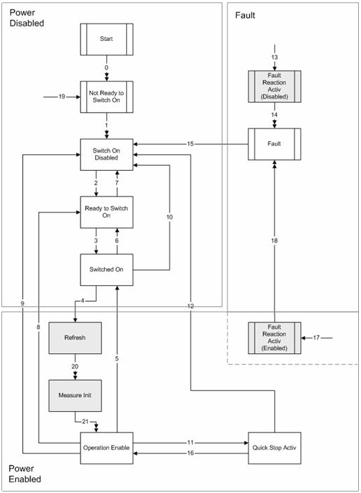

# 8 Device Control
## 8.1 State Machine

The state machine describes the device state and the possible control sequence of the drive. A single state represents a special internal or external behaviour. The state of the drive also determines which commands are accepted.

States may be changed using the Controlword and / or according to internal events. The current state can be read using the Statusword.

Figure 3: Device State Machine		
		
		
		
## 8.1.1 State of the drive		
		
The following bits of the Statusword indicate the current state of the drive.		
		
		
		
|State                              |Statusword [binary]	|Description|
|-----------------------------------|-----------------------|-----------|
|Start	                            |x0xx xxx0 x000 0000	|Bootup|
|Not Ready to Switch On	            |x0xx xxx1 x000 0000	|The current offset will be measured. The drive function is disabled|
|Switch On Disabled	                |x0xx xxx1 x100 0000	|The drive initialization is complete. The drive parameters may be changed. The drive function is disabled|
|Ready to Switch On	                |x0xx xxx1 x010 0001	|The drive parameters may be changed. The drive function is disabled|
|Switched On	                    |x0xx xxx1 x010 0011	|The drive function is disabled|
|Refresh	                        |x1xx xxx1 x010 0011	|Refresh power stage|
|Measure Init	                    |x1xx xxx1 x011 0011	|The power is applied to motor. The motor resistance or the commutation delay is measured|
|Operation Enable	                |x0xx xxx1 x011 0111	|No faults have been detected. The drive function is enabled and power is applied to motor|
|Quick Stop Active	                |x0xx xxx1 x001 0111	|The quick stop function is being executed. The drive function is enabled and power is applied to motor|
|Fault Reaction Active (disabled)	|x0xx xxx1 x000 1111	|A fault has occurred in the drive. The drive function is disabled|
|Fault Reaction Active (enabled)	|x0xx xxx1 x001 1111	|A fault has occurred in the drive. The quick stop function is being executed. The drive function is enabled and power is applied to motor|
|Fault	                            |x0xx xxx1 x000 1000	|A fault has occurred in the drive. The drive parameters may be changed. The drive function is disabled|
		
Table 1:      Device state bits		
		
## 8.1.2 State transitions		
		
State transitions are caused by internal events in the drive or by commands from the host via the Controlword.		
		
|Transition	|Event		                                                                |Action                                            |
|-----------|---------------------------------------------------------------------------|--------------------------------------------------|
|0			|Reset																		|Initialize drive                                  |
|1			|The drive has initialized successfully										|Activate communication                            |
|2			|‘Shutdown’ command received												|	                                               |
|3			|‘Switch On’ command received												|                                                  |
|4			|‘Enable Operation’ command received										|Refresh power section                             |
|5			|‘Disable Operation’ command received										|Disable power section; disable drive function     |
|6			|‘Shutdown’ command received												|	                                               |
|7			|‘Quick Stop’ or ‘Disable Voltage’ command received							|                                                  |
|8			|‘Shutdown’ command received												|Disable power section; disable drive function     |
|9			|‘Disable Voltage’ command received											|Disable power section; disable drive function     |
|10			|‘Quick Stop’ or ‘Disable Voltage’ command received							|                                                  |
|11			|‘Quick Stop’ command received												|Setup Quickstop profile                           |
|12			|‘Disable Voltage’ command received											|Disable power section; disable drive function     |
|13			|A fault has occurred not during ‘Operation Enable’ or ‘Quick Stop’ State	|Disable power section; disable drive function     |
|14			|The fault reaction is completed											|	                                               |
|15			|‘Fault Reset’ command received												|Reset fault condition if no fault exists currently|
|16			|‘Enable Operation’ command received										|Enable drive function                             |
|17			|A fault has occurred during ‘Operation Enable’ or ‘Quick Stop’ State		|Setup Quickstop profile                           |
|18			|The fault reaction is completed											|Disable power section; Disable drive function     |
|19			|A Node Reset was received													|Initialize drive                                  |
|20			|Refresh cycle finished														|Enable power section                              |
|21			|Measure Init cycle finished												|Enable drive function                             |

Table 2:      Drive state transitions		
		
*Note: If a command is received which causes a change of state, this command will be processed completely and the new state attained before the next command can be processed.*		
		
## 8.1.3 Device control commands		
		
Device control commands are triggered by the following bit patterns in the Controlword.	
		
|Command			|LowByte of Controlword [*binary*]  |State transition|
|-------------------|-----------------------------------|----------------|
|Shutdown			|0xxx x110						    |2,6,8           |
|Switch On			|0xxx x111						    |3               |
|Disable Voltage	|0xxx xx0x						    |7,9,10,12       |
|Quick Stop			|0xxx x01x						    |7,10,11         |
|Disable Operation	|0xxx 0111						    |5               |
|Enable Operation	|0xxx 1111						    |4,16            |
|Fault Reset		|0xxx xxxx à 1xxx xxxx			    |15              |
		
Table 3:      Device control commands		
